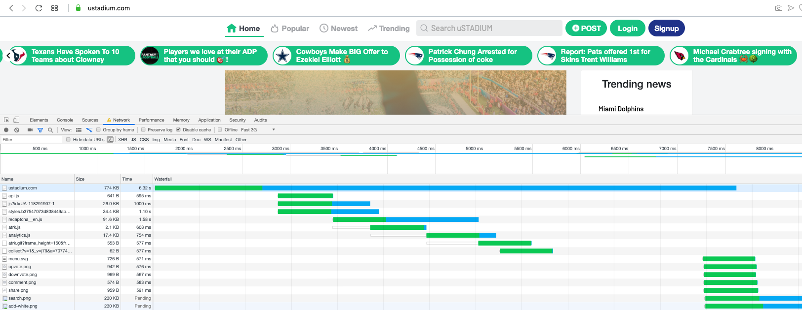
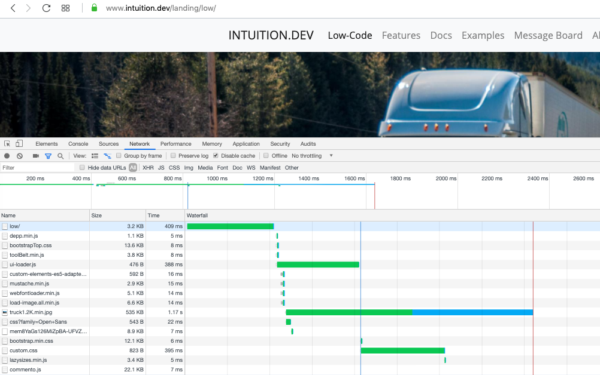

# Relative performance of Webpack, vs/ modern lazy loading w/JAMstack, w/ Pug approach; and future of 'import'

#### Please star our main project here:
- https://github.com/intuition-dev/INTUITION

### How to measure performance:
Performance is important especially mobile users where they have limited bandwidth of how much can be loaded at once. And majority of users are using the web on their mobile 4g device.
I am surprised by how many programmers are not leveraging the built into browsers tools: the network tab. The browser's developer tools network tab will show you the performance of your application that the end user on a mobile device would have. To often programmers use their own experience, based on their development machine. So lets look at the two approaches as distinct.

### Champion:
We developers have been using Webpack for about 5-10 years, we used it to replace ```<script src="main.js"></script>``` all over the place. 
IMO, Webpack approach is getting long on the tooth. Even when you try to mimic lazy load with Webpack you are much slower than apps using modern approaches.

### Challenger:
JAMstack, w/ Pug is a newer approach to developing, among other things using the edge by leveraging a CDN. (One benefit of JAMstack, w/ Pug: the https handshake that takes 4-6 round 
trips is at the edge, and much closer to each end user; thus improving performance of each connection. Also, edge traffic is cheaper than origin - faster and cheaper works for me). For lazy loading dependencies I use ```depp.require()```, from a tool released just last year ( https://github.com/muicss/johnnydepp/releases ).

Sample runtime code:
```
	depp.define({
		'a': 'https://jsdeliver.com/libs/a.js'
		'b': '/b.js'
	})
	depp.require('a', function() {
		// we can do A
		depp.require('b', function() {
			// we can do B
		})
	})
```
You can see how tightly we can control what gets loaded when. So now that we can control loading, how should we maximite the performance of the 'first meaningful paint'(FML)?

### Comparison:

It is a bit hard to find examples of application done both ways, but here are two examples, one of each. Both are using the development tools Network Tab. Best way to
improve legibility is to in browser click the image and 'Open Image in new tab', or just run the test in your own browser. 

##### A Webpack example:



Notice that it (https://ustadium.com) loads a 600kb and 700kb files first. Rendering can't start for 6 seconds when used with 4g.

##### Modern lazy loading JAMStack example:



Notice that it (https://www.INTUITION.DEV/landing/low/) loads 3k and 4k files first.
And that any 3rd party .js is loaded after everything that I need.

Again, not apples to apples, but it gives you the idea of how they would differ in preformance.

### Future of 'import':

A best practice would be to use an import that works on a CDN, and can delay instantiating a class until requirements are ready.
But that is not how imports work today. Fortunately, the spec writers are planing on an improved import spec coming out. 
Once the new spec is set, we can start leveraging that. 


### Can we have *today* use the future functionality of import? YES!:

We can today start using CDN loading dependencies, I do in my projects that leverage www.INTUITION.DEV. We use a factory pattern, here is how:

1. You must disable the constructor so it can't work externally. Throw an error.
Instead create another static method to 'create', for example inst(). 

2. You static method must return a promise! In the static method you can depp.require() anything you need, and wait for it to resolve. 

3. Once your static method resolved: return the new instance of the class (in a promise). Force the constructor to work and return the new instance. 

[Example source code  ](https://github.com/intuition-dev/INTUITION/blob/master/examples/CRUD/www/models/CRUD1ViewModel.ts)

<b>Best practice: each file should load it's own resources, but the popular source definitions can be centralized</b>


### Summary:

As a manager you need to look at the app in the Developer Tools network tab.
And when you QA the app on mobile: Don't use WiFi!
If you monitor the little things, the big things will take care of themselves performance wise.
Also consider converting an older Webpack Web App to JAMstack, w/ Pug lazy loading to get the performance benefits.


## Deeper dive recipe/tips:
There are two things we need: data loading and ui loading. They are loaded in parallel, but we'll look at them one at a time.

#### UI-loading:

1. For UI, you want to in head load the smallest CSS: that does the layout and will avoid layout jank.
Leave the fonts out, since: the fonts have not loaded yet! 
Most popular CSS framework is BootStrap, here is what topCss would look like:
- https://github.com/intuition-dev/toolBelt/blob/master/bootStrap/scss/bootstrapTop.scss
Notice I comment out as much as I can so resulting CSS is small.

2. I sometimes start loading a background image in head - using a lib like 'load-image'. Alternative is that browser finishes ~100ms worth or work, and then starts
loading the background image. I save 100ms by starting the load now.

3. Also in head you need to load the spinner - in my case the spinner is built into BootStrap. I can show it if needed.
And that's it, we can go to the body!
Since JAMstack, w/ Pug is static - the screen content is already at the edge. Also from SEO POV, SEO is graded on performance so we get a nice SEO score boost.
The body load should be very quick and we have our first FML.  (And I have not loaded fonts yet, font glyphs are quite large)

4. If I'm using a component library or need poly fills - I load that in head. 

5. So in the body now. I don't need to say that you should optimize each image for performance. (I use a node script to CLI process images, check my git project for more).
And that images should be lazy loaded, eg; using lazysizes.

6. Now you load fonts, but use a webfontloader so you are notified that font is loaded. This is one of the many ways to avoid FOUT. 

7. Now you can load your real full css, each element now looks nicer and fonts look nicer. The head css just made it OK and removed, but now it looks nicer. As opposed to FML, this is now enhanced. Since loading is in parallel a regular end user would only notice that the page loads fast.

8. Now you can load any 3rd party libs, like analytics, or marketing or ads, etc. They all want to be in script in head to make their products look good. Forget it, I'm not
loading their stuff before I even loaded my fonts. 

9. Now you can load DOM libs and interaction libs. There are no interactions that a user can do while page is still rendering. So don't load any of it ahead of FML.
That is for UI-loading.

#### Data-loading:

1. At the same time UI assets are loading, I'm loading things so I can do my fetch( or Ajax)
It is important to start the fetch in head!
The data can be in flight when you get out of head, but the request must be in head.
So what ever you need to do get the non-ui requests for data in flight in head: do it.

No need to data binding in head, but the request must be in flight before body starts loading. 
You have to look at the network tab to get that to happen ASAP.

2. In body, you need to wait on two events:
a) your data is back
b) the ui is ready
Once both are done you can bind/show the data.
So you see how you need to optimize both, ui-loading and data-loading to insure user experiences high performance.

### Full example:
A full example of UI-loading and data-loading including syncing the two source code:
- https://github.com/intuition-dev/INTUITION/tree/master/examples/CRUD/www

<i>ps: If you have a webpack application that you are considering improving, you can reach out to me at www.MetaBake.NET</i>. 

## Code Questions?
- http://forum.mbake.org


